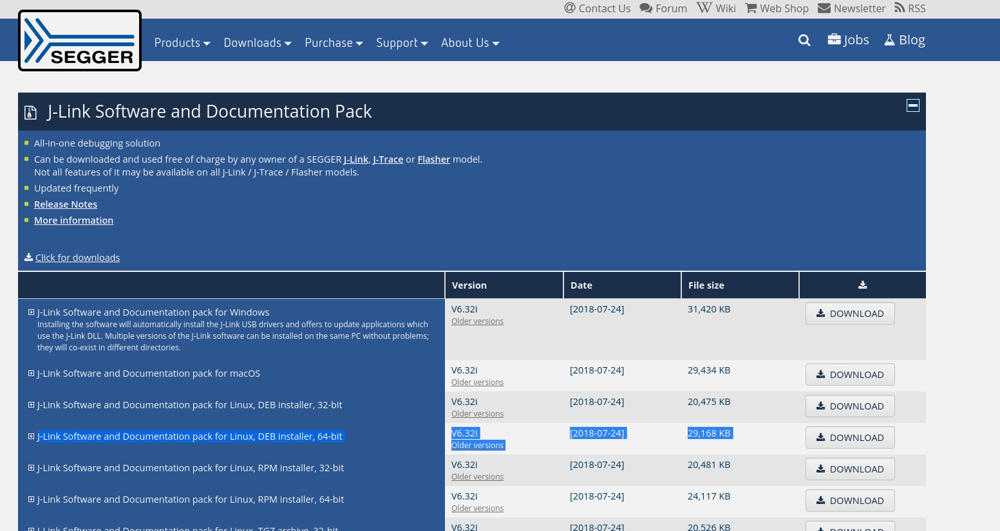

# Getting Started with Nordic

# Programming Cables -- the Segger JLink

Many of the Nordic boards out there come with a Segger JLink built in.

If you want to make your own PCB, recommend to grab a Segger JLink programmer.


# Installation


##  Download the Segger software

Go to: https://www.segger.com/downloads/jlink/ and look for the section shown in image below, and download for your operating system:



## Linux Installation

install the .deb with the following command:

`sudo dpkg -i <deb-package>`

Subbing in the `JLink***.deb` file name for the `<deb-package>`

current time of writing the latest is `JLink_Linux_V634b_x86_64.deb`, so the command looks like:

`sudo dpkg -i JLink_Linux_V634b_x86_64.deb`

## Download the Nordic CLI tools

http://infocenter.nordicsemi.com/index.jsp?topic=%2Fcom.nordic.infocenter.tools%2Fdita%2Ftools%2Fnrf5x_command_line_tools%2Fnrf5x_installation.html


## Download the Soft Device


Download the latest soft device for your hardware at time of writing, 
this is the S140 for the NRF52840 evk.

https://www.nordicsemi.com/eng/Products/S140-SoftDevice

unzip the file (potentially with the `unzip` cli tool as follows):

`unzip s140_nrf52_6.1.0.zip`

This will create a `.hex` file in the same folder, the above command specifically will creates the `s140_nrf52_6.1.0_softdevice.hex` file.

## Program the Softdevice and Verify

`nrfjprog --family NRF52 --program s140_nrf52_6.1.0_softdevice.hex --chiperase --verify`

ypor terminal should provide a success message similar to one shown below:

```sh
nrf52_6.1.0_softdevice.hex  --chiperase --verify
Parsing hex file.
Erasing user available code and UICR flash areas.
Applying system reset.
Checking that the area to write is not protected.
Programming device.
Verifying programming.
Verified OK.
```

## Download the NRF SDK with samples


Go to the downloads tab and click on the zip compatible with the softdevice you selected (in our case the S140):

https://www.nordicsemi.com/eng/Products/Bluetooth-low-energy/nRF5-SDK


## program an example hex for blinky

unzip as before with `unzip` command, and cd in to the following example in the examples folder of the SDK directory:

`cd nRF5_SDK_15.0.0_a53641a/examples/ble_peripheral/ble_app_blinky/hex`

afterwards program the hex for the particular pca device you have and test it out (for the nrf52840 evk this is the pca10056);
`nrfjprog --family NRF52 --program ble_app_blinky_pca10056_s140.hex --verify --chiperase`


## start the program

Finally reset the mcu to start the program:

`nrfjprog --family NRF52 --reset`


